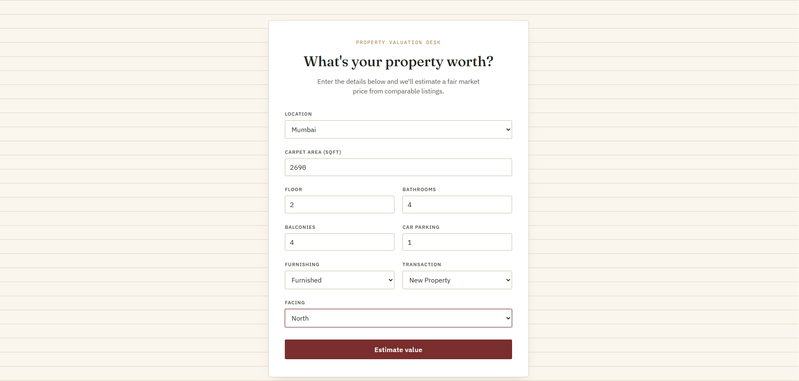
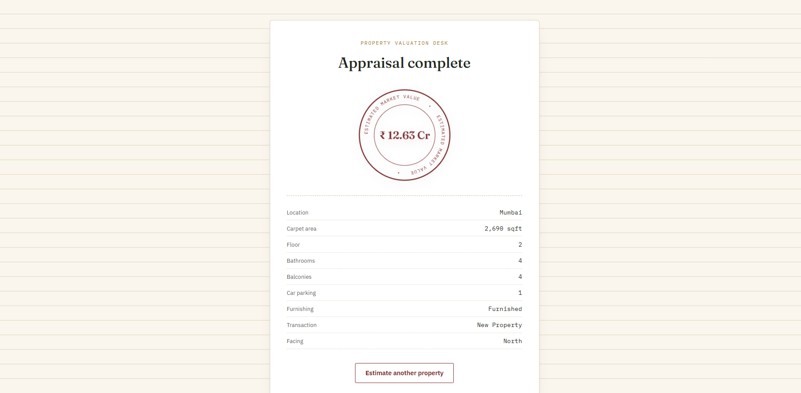

# House Price Prediction — End-to-End ML Web App

An end-to-end machine learning product that estimates the market price of a residential
property in India: a cleaned dataset and trained regression models (Jupyter notebooks), a
**FastAPI** backend that serves the winning model, and a **React + TypeScript** frontend where
a user enters property details and gets an instant price estimate.

## Overview

The pipeline has four stages:

1. **Data cleaning & EDA** (`notebooks/01_eda_cleaning_visualization.ipynb`) — turns a messy,
   ~187k-row Kaggle listings dataset into a clean, model-ready CSV.
2. **Modeling** (`notebooks/02`–`04`) — trains and compares three regression models on the
   clean data, and exports each one as a self-contained `scikit-learn` pipeline (`.pkl`).
3. **Backend** (`backend/`) — a FastAPI service that loads the winning model once at startup
   and exposes a `POST /predict` endpoint.
4. **Frontend** (`frontend/`) — a React form where a user enters a property's details and sees
   the predicted price.

## Architecture

```
┌─────────────────────┐        ┌──────────────────────┐        ┌───────────────────────────┐
│   notebooks/         │        │   backend/            │        │   frontend/                │
│                       │        │                       │        │                            │
│  01 EDA + cleaning    │──CSV──▶│  house_price.pkl      │◀──────▶│  React + TypeScript + Vite │
│  02 Linear Regression │        │  (Pipeline: impute +  │  JSON  │                            │
│  03 Random Forest  ★  │──.pkl─▶│   encode + regressor) │  HTTP  │  PredictionForm             │
│  04 Gradient Boosting │        │                       │        │   → POST /predict           │
│                       │        │  FastAPI (:8000)      │        │   → ResultPage               │
│                       │        │   GET  /health        │        │                            │
│                       │        │   POST /predict       │        │  (dev server on :5173)      │
└─────────────────────┘        └──────────────────────┘        └───────────────────────────┘
```

`★` Random Forest was selected as the production model — see [Model Metrics](#model-metrics) below.

## Tech Stack

| Layer | Technology |
|---|---|
| Data & modeling | Python, pandas, numpy, scikit-learn, matplotlib, seaborn, Jupyter |
| Backend | FastAPI, Pydantic / pydantic-settings, uvicorn, joblib |
| Frontend | React 19, TypeScript, Vite, React Router |
| Testing | pytest, FastAPI `TestClient` |

## Project Structure

```
house-price-project/
├── notebooks/
│   ├── 01_eda_cleaning_visualization.ipynb   # EDA → cleaning → visualization → export clean CSV
│   ├── 02_linear_regression.ipynb            # Baseline model
│   ├── 03_random_forest.ipynb                # Winning model
│   ├── 04_gradient_boosting.ipynb            # HistGradientBoostingRegressor
│   └── data/
│       ├── house_prices.csv                  # Raw dataset (download separately, see below)
│       └── house_prices_clean.csv            # Cleaned dataset produced by notebook 01
├── models/                                   # Copy of every trained model (from the notebooks)
│   ├── linear_regression.pkl
│   ├── random_forest.pkl                     # ← also copied into backend/models/house_price.pkl
│   └── gradient_boosting.pkl
├── backend/
│   ├── app/
│   │   ├── main.py                           # FastAPI app, CORS, model loaded at startup
│   │   ├── api/routes/prediction.py           # GET /health, POST /predict
│   │   ├── core/config.py                     # Settings from .env (pydantic-settings)
│   │   ├── schemas/prediction.py               # PredictionRequest / PredictionResponse
│   │   ├── services/
│   │   │   ├── preprocessing.py                # Turns a request into a one-row DataFrame
│   │   │   └── inference.py                    # Loads house_price.pkl, runs predict()
│   │   └── utils/logging_config.py
│   ├── models/
│   │   ├── house_price.pkl                    # The serving model (Random Forest)
│   │   └── locations.json                     # Locations the model was trained on
│   ├── tests/test_prediction.py
│   ├── requirements.txt
│   ├── .env.example
│   └── Dockerfile
└── frontend/
    ├── src/
    │   ├── api/predictionClient.ts             # fetch wrapper, base URL from VITE_API_BASE_URL
    │   ├── components/PredictionForm.tsx        # The form (+ validation, loading, error states)
    │   ├── pages/HomePage.tsx | ResultPage.tsx | NotFoundPage.tsx
    │   ├── types/prediction.ts                  # TS types mirroring the backend schema
    │   └── App.tsx                              # routes: / , /result , * (404)
    └── .env.example
```

## Dataset

**[House Price](https://www.kaggle.com/datasets/juhibhojani/house-price)** by Juhi Bhojani
(Kaggle) — ~187,000 real property listings from India.

The raw CSV is **not** committed to this repository (it's large and easy to re-download).
To get it:

**Option A — manual:** open the dataset page, click **Download**, unzip, and place
`house_prices.csv` in `notebooks/data/`.

**Option B — Kaggle CLI:**
```bash
pip install kaggle
# Get an API token: Kaggle → Settings → API → "Create New Token"
# Place kaggle.json in C:\Users\<you>\.kaggle\ (Windows) or ~/.kaggle/ (macOS/Linux)
kaggle datasets download -d juhibhojani/house-price -p notebooks/data --unzip
```

Then open `notebooks/01_eda_cleaning_visualization.ipynb` and run it top-to-bottom — it
produces `notebooks/data/house_prices_clean.csv`, which the three modeling notebooks read.

## Backend Setup

```bash
cd backend
python -m venv .venv
.venv\Scripts\activate        # Windows
# source .venv/bin/activate   # macOS / Linux

pip install -r requirements.txt
cp .env.example .env

uvicorn app.main:app --reload
```

The API is now running at `http://localhost:8000`. Open `http://localhost:8000/docs` for the
interactive Swagger UI, or run the test suite:

```bash
pytest
```

### Backend environment variables (`.env`)

| Variable | Default | Description |
|---|---|---|
| `MODEL_PATH` | `models/house_price.pkl` | Path to the trained model pickle |
| `LOCATIONS_PATH` | `models/locations.json` | Locations the model was trained on (used to map unknown locations to `"other"`) |
| `CORS_ORIGINS` | `http://localhost:5173` | Comma-separated list of origins allowed to call the API |

## Frontend Setup

```bash
cd frontend
npm install
cp .env.example .env

npm run dev
```

The app is now running at `http://localhost:5173`. Make sure the backend is running first (see
above), fill in the form, and submit to see a live prediction.

To verify everything is production-ready:
```bash
npm run build
```

### Frontend environment variables (`.env`)

| Variable | Default | Description |
|---|---|---|
| `VITE_API_BASE_URL` | `http://localhost:8000` | Base URL of the FastAPI backend |

## API Reference

### `GET /health`
Returns the API's health status.

```bash
curl http://localhost:8000/health
```
```json
{"status": "ok"}
```

### `POST /predict`
Predicts a property's price in INR from its details.

```bash
curl -X POST http://localhost:8000/predict \
  -H "Content-Type: application/json" \
  -d '{
    "location": "mumbai",
    "carpet_area_sqft": 950,
    "floor_num": 4,
    "bathroom": 2,
    "balcony": 1,
    "car_parking": 1,
    "furnishing": "Semi-Furnished",
    "transaction": "Resale",
    "status": "Ready to Move",
    "facing": "East"
  }'
```
```json
{"predicted_price": 37349918.07}
```

| Field | Type | Notes |
|---|---|---|
| `location` | string | City slug (e.g. `"mumbai"`). Unknown values are mapped to `"other"`. See `backend/models/locations.json` for the full list. |
| `carpet_area_sqft` | float | Must be > 0 |
| `floor_num` | int | `0` = ground floor, `-1` = basement |
| `bathroom` | int | ≥ 0 |
| `balcony` | int | ≥ 0 |
| `car_parking` | int | ≥ 0 (default `0`) |
| `furnishing` | string | `"Furnished"` \| `"Semi-Furnished"` \| `"Unfurnished"` |
| `transaction` | string | `"New Property"` \| `"Resale"` \| `"Rent/Lease"` \| `"Other"` |
| `status` | string | Construction status, e.g. `"Ready to Move"` |
| `facing` | string | `"East"`, `"North"`, `"North - East"`, `"North - West"`, `"South"`, `"South - East"`, `"South -West"`, `"West"` |

Invalid input (missing required fields, `carpet_area_sqft <= 0`, etc.) returns `422
Unprocessable Entity` with a Pydantic validation error body.

## Model Metrics

All three models share the same cleaned feature set and an 80/20 train/test split
(`random_state=42`). Metrics below are on the **held-out test set**.

| Model | MAE (INR) | RMSE (INR) | R² |
|---|---:|---:|---:|
| Linear Regression (baseline) | 4,557,220 | 8,472,520 | 0.616 |
| **Random Forest ★ (served in production)** | **1,475,791** | **5,635,305** | **0.830** |
| Gradient Boosting (HistGradientBoostingRegressor) | 1,682,534 | 5,790,475 | 0.820 |

**Why Random Forest:** it has the lowest MAE/RMSE and the highest R² of the three, comfortably
beating the Linear Regression baseline by capturing non-linear interactions between area,
location, and amenities without manual feature engineering. Gradient Boosting performs almost
as well and would be a reasonable alternative with further hyperparameter tuning; full
comparisons, cross-validation, and feature-importance plots are in the corresponding
notebooks.

> **Note:** `notebooks/04_gradient_boosting.ipynb` uses `HistGradientBoostingRegressor`
> instead of the classic `GradientBoostingRegressor`. On this ~175k-row dataset, the classic
> implementation took well over 3 minutes to train (and longer on constrained hardware),
> while the histogram-based implementation trains in seconds with comparable accuracy — see
> the notebook for the full reasoning.

## Version Pinning

The exported model pickles were trained with **scikit-learn 1.7.2** (see
`backend/requirements.txt`). A pickle only loads reliably with the same scikit-learn version it
was trained with — if you retrain the notebooks with a different scikit-learn version, update
`requirements.txt` to match.

## Screenshots

**Home page — the valuation form:**



**Result page — predicted price with property summary:**




